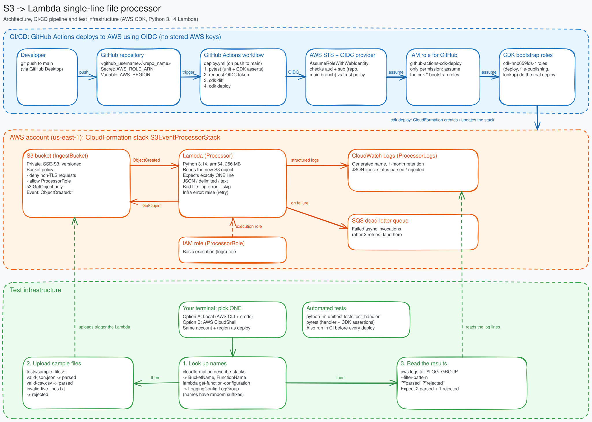

# S3 single-line file processor (AWS CDK, Python)

S3 bucket -> `ObjectCreated` notification -> Python 3.14 Lambda that parses the one-line file.

```
app.py                         CDK entry point
s3_event_processor/stack.py    Bucket, bucket policy, Lambda, event notification
lambda_src/handler.py          Lambda code
tests/                         Handler unit tests (stdlib) + stack assertions (pytest)
tests/sample_files/            Sample files for testing the deployed stack (valid JSON, valid CSV, 5-line reject)
.github/workflows/deploy.yml   CI/CD: test and deploy on push to main
scripts/create-github-oidc-role.sh  One-time IAM role setup for GitHub -> AWS OIDC
```

## Where to run the AWS commands: Local **or** CloudShell

Several steps below use the AWS CLI. You can run them in **one of two places**. Pick one and use it throughout:

- **Option A: Local.** Your own terminal. Needs the AWS CLI installed and configured with credentials for the target
  AWS account (and Node.js, for steps that use `npx`).
- **Option B: AWS CloudShell.** The terminal built into the AWS console (the `>_` icon in the top bar). Nothing to
  install, and it is already signed in as your console user. It uses whichever region is selected in the console,
  so check that it matches the region you are deploying to.

Wherever a step shows both options, **run only one of them, not both.** Running both just repeats the same action
(and some steps, like creating the IAM role, will fail the second time because the resource already exists).
If you switch between Local and CloudShell part-way through, note that shell variables (such as `BUCKET`) do not
carry over. Re-run the "look up" commands in the new terminal.

In the commands below, replace `<github_username>` and `<repo_name>` with your GitHub username and repository name. Note that in this exercise, the variable lines in `scripts/create-github-oidc-role.sh` for `ROLE_NAME` and `REPO` are unchanged from my initial work and testing.

## Deploy

```bash
python3 -m venv .venv && source .venv/bin/activate
pip install -r requirements-dev.txt
npm install -g aws-cdk            # CDK CLI
cdk bootstrap                     # once per account/region
cdk deploy
```

## Test

```bash
python -m unittest tests.test_handler   # no dependencies needed
pytest                                  # includes stack assertions
```

## CI/CD (GitHub Actions)

`.github/workflows/deploy.yml` runs on every push to `main` (and manually via "Run workflow"). It installs
dependencies, runs the tests, then runs `cdk diff` and `cdk deploy`. If the tests fail, nothing is deployed.

It authenticates to AWS with GitHub's OIDC integration, so no AWS access keys are stored in GitHub.
Complete this one-time setup before the first run. Steps 1 and 2 use the AWS CLI, so run them in **Local or
CloudShell, whichever you chose above (not both)**.

### 1. Bootstrap the AWS account

Run once per account/region. Bootstrapping doesn't need this project's code. The command is the same in both
places, so run it in **one** of them:

- **Option A: Local.** Requires Node.js (for `npx`). If your credentials live in a named profile, run
  `export AWS_PROFILE=<profile>` first (or add `--profile <profile>` to the commands).
- **Option B: CloudShell.** Nothing to set up. Node.js is already there, and the region is whatever is selected in
  the console.

```bash
ACCOUNT_ID=$(aws sts get-caller-identity --query Account --output text)
REGION=us-east-1   # change to the region you want to deploy to
npx aws-cdk@2 bootstrap aws://$ACCOUNT_ID/$REGION
```

### 2. Create the IAM role that GitHub can assume

`scripts/create-github-oidc-role.sh` does this for you. It creates the GitHub OIDC provider (if missing),
creates a role that only trusts workflows on the `main` branch of `<github_username>/<repo_name>`, and lets that
role assume the CDK bootstrap roles. Run it with admin-level credentials, and note the role ARN it prints at the end.

Set `REPO` to your own `<github_username>/<repo_name>` when you run it. **Choose one option:**

**Option A: Local**

```bash
chmod +x scripts/create-github-oidc-role.sh
REPO=<github_username>/<repo_name> ./scripts/create-github-oidc-role.sh
```

**Option B: CloudShell.** Upload the script file rather than pasting it (Actions -> Upload file), then run it:

```bash
chmod +x create-github-oidc-role.sh
REPO=<github_username>/<repo_name> ./create-github-oidc-role.sh
```

Avoid pasting the script into `nano`: a truncated paste can cut the script off partway (after the role is
created but before its permissions are attached) without any error. A complete run ends with
`Verified: role and cdk-deploy policy are in place.` followed by `Done.` If you don't see both lines, the
script did not finish. You can also check with `aws iam list-role-policies --role-name github-actions-cdk-deploy`,
which should list `cdk-deploy`.

To use a different role name, also set `ROLE_NAME=my-role` on the same line as `REPO=...`.
To grant more than the default permissions (for example `AdministratorAccess` on a throwaway account), attach
a policy to the role afterwards. Broader than needed, but handy for troubleshooting a permissions error.

**About the `sub` condition:** newer GitHub repos issue tokens whose `sub` claim includes numeric owner and repo
IDs, like `repo:<github_username>@<owner_id>/<repo_name>@<repo_id>:ref:refs/heads/main`, instead of the classic
`repo:<github_username>/<repo_name>:ref:refs/heads/main`. The script's trust policy accepts both forms, with the IDs
wildcarded (`repo:<github_username>@*/<repo_name>@*:ref:refs/heads/main`), so it still only trusts your owner, repo
name and the `main` branch without hard-coding IDs. The trade-off: the IDs exist to stop someone who deletes and
re-creates an account or repo under the same name from matching, and wildcarding them gives that up. To pin exact
values instead, run the script with `SUBJECT="<exact sub>"`.

If the workflow fails with `Not authorized to perform sts:AssumeRoleWithWebIdentity`, add a temporary step before
the credentials step that prints the real `sub` claim (decode the OIDC token from `ACTIONS_ID_TOKEN_REQUEST_URL`)
and compare it with the role's trust policy.

### 3. Add settings in GitHub

In the browser (not the terminal): Repo -> Settings -> Secrets and variables -> Actions:

| Type     | Name           | Value                                   |
| -------- | -------------- | --------------------------------------- |
| Secret   | `AWS_ROLE_ARN` | ARN of the role created in step 2       |
| Variable | `AWS_REGION`   | Region you bootstrapped, e.g. `us-east-1` |


## Test the deployed stack

The bucket, function and log group names contain random suffixes (for example `...-ZDPusCImnIkd`), so look
them up from the CloudFormation stack instead of typing them. Use the same AWS account and region you deployed to.

The sample files in `tests/sample_files/` cover three cases:

| File                     | Contents                          | Expected result                                          |
| ------------------------ | --------------------------------- | -------------------------------------------------------- |
| `valid-json.json`        | `{"id": 42, "name": "widget"}`    | `parsed`, `format: json`                                 |
| `valid-csv.csv`          | `1,Alice,NYC`                     | `parsed`, `format: delimited`, `data: ["1","Alice","NYC"]` |
| `invalid-five-lines.txt` | five lines of words               | `rejected`, `expected a single line, found 5`            |

### 4. Get set up (choose one option)

**Option A: Local.** Run from the project folder:

```bash
export AWS_DEFAULT_REGION=us-east-1     # the region you deployed to
# export AWS_PROFILE=<profile>          # only if you use a named profile
DIR=tests/sample_files
```

**Option B: CloudShell.** Get the three sample files into CloudShell, either by uploading them
(Actions -> Upload file) or by creating them with the commands below. Then set the region and folder:

```bash
printf '{"id": 42, "name": "widget"}\n' > valid-json.json
printf '1,Alice,NYC\n' > valid-csv.csv
cat > invalid-five-lines.txt <<'EOF'
maple quartz lantern river ember
violet harbor anchor thistle pebble
copper meadow falcon lattice orbit
saffron glacier compass willow ripple
cinder juniper velvet horizon mosaic
EOF

export AWS_DEFAULT_REGION=us-east-1     # the region you deployed to
DIR=.
```

Steps 5 and 6 are the same for both options. Run them in whichever terminal you used above.

### 5. Look up the bucket, function and log group

```bash
STACK=S3EventProcessorStack

BUCKET=$(aws cloudformation describe-stacks --stack-name $STACK \
  --query "Stacks[0].Outputs[?OutputKey=='BucketName'].OutputValue" --output text)

FUNC=$(aws cloudformation describe-stacks --stack-name $STACK \
  --query "Stacks[0].Outputs[?OutputKey=='FunctionName'].OutputValue" --output text)

# The log group has its own generated name (not /aws/lambda/<function>), so ask the function where it logs:
LOG_GROUP=$(aws lambda get-function-configuration --function-name "$FUNC" \
  --query LoggingConfig.LogGroup --output text)

echo "Bucket:    $BUCKET"
echo "Function:  $FUNC"
echo "Log group: $LOG_GROUP"
```

### 6. Upload the files and read the results

```bash
for f in valid-json.json valid-csv.csv invalid-five-lines.txt; do
  aws s3 cp "$DIR/$f" "s3://$BUCKET/$f"
done

sleep 10
aws logs tail "$LOG_GROUP" --since 5m --filter-pattern '?"parsed" ?"rejected"'
```

You should see one line per file, for example:

```
{"status": "parsed", "bucket": "...", "key": "valid-json.json", "bytes": 29, "format": "json", "data": {"id": 42, "name": "widget"}}
{"status": "parsed", "bucket": "...", "key": "valid-csv.csv", "bytes": 12, "format": "delimited", "delimiter": ",", "data": ["1", "Alice", "NYC"]}
{"status": "rejected", "key": "invalid-five-lines.txt", "reason": "expected a single line, found 5"}
```

If nothing appears, wait a few more seconds and re-run the `tail`, or drop `--filter-pattern` to see everything.
You can also browse the same logs in the console: Lambda -> your function -> Monitor -> View CloudWatch logs.

### Troubleshooting

- `Stack ... does not exist`: wrong region or account. Check `aws sts get-caller-identity` and `AWS_DEFAULT_REGION`.
- `The specified log group does not exist`: you used `/aws/lambda/<function>`. Use the `LOG_GROUP` value from step 2.
- Uploads work but nothing is logged: in the S3 console open the bucket -> Properties -> Event notifications and
  confirm an "all object create events" rule points at the function.

### Notes

- If the project lives in a subfolder of the repo rather than the root, add
  `defaults: run: working-directory: <subfolder>` to the job, and point `cache-dependency-path` at that
  folder. The workflow file itself must stay in the repo's root `.github/workflows/` folder.
- The job's `concurrency` setting queues deploys so two never run against the stack at once.

## Clean up

`cdk destroy` (bucket is set to auto-delete its objects; switch to `RETAIN` for production).